  
    en vivo → <a href="https://constructorafadex.com.pe">fadex</a> ·
    <a href="https://abidetalles.web.app">abidetalles</a> ·
    <a href="https://calmaperu.com">calma perú</a> ·
    <a href="https://safirox-zeta.vercel.app">safirox</a>
    &nbsp;|&nbsp; todo con detalle en el <a href="https://portafoliogama.vercel.app">portafolio</a>
  

  
<code>↑ ↑ ↓ ↓ ← → ← → B A</code>

   
  

  🔒 el código de mis clientes vive en repos privados · estos paneles los dibuja <a href="scripts">Python</a> y el de contribuciones se actualiza solo cada día con GitHub Actions

