<a href="https://portafoliogama.vercel.app">
  
</a>


<a href="https://safirox-zeta.vercel.app">
  
</a>

<a href="https://portafoliogama.vercel.app/projects/trimflow">
  
</a>

<a href="https://portafoliogama.vercel.app/projects/examora">
  
</a>



  
    en vivo → <a href="https://constructorafadex.com.pe">fadex</a> ·
    <a href="https://abidetalles.web.app">abidetalles</a> ·
    <a href="https://calmaperu.com">calma perú</a> ·
    <a href="https://safirox-zeta.vercel.app">safirox</a>
    &nbsp;|&nbsp; todo con detalle en el <a href="https://portafoliogama.vercel.app">portafolio</a>
  




<a href="https://portafoliogama.vercel.app">
  
</a>
