

  
  
  

## `> whoami`

Soy **Adrián Abel Gamarra**. Hago apps y páginas web **para negocios reales**: tiendas online, apps de reservas, paneles para administrar todo y sistemas que reemplazan el Excel y el cuaderno.
Trabajo con **DCG Triak**, desde Arequipa, Perú.

> [!NOTE]
> Mi código vive en repos privados: casi todo son proyectos de clientes. Aquí abajo están las capturas y las demos que se pueden abrir.

## `> ls ~/proyectos`

<table>
  <tr>
    <td width="50%"><a href="https://portafoliogama.vercel.app/projects/examora">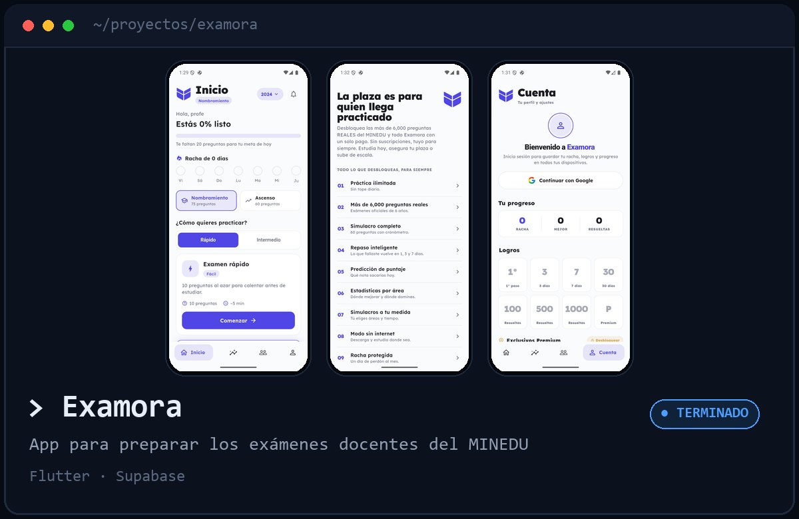</a></td>
    <td width="50%"><a href="https://portafoliogama.vercel.app/projects/trimflow">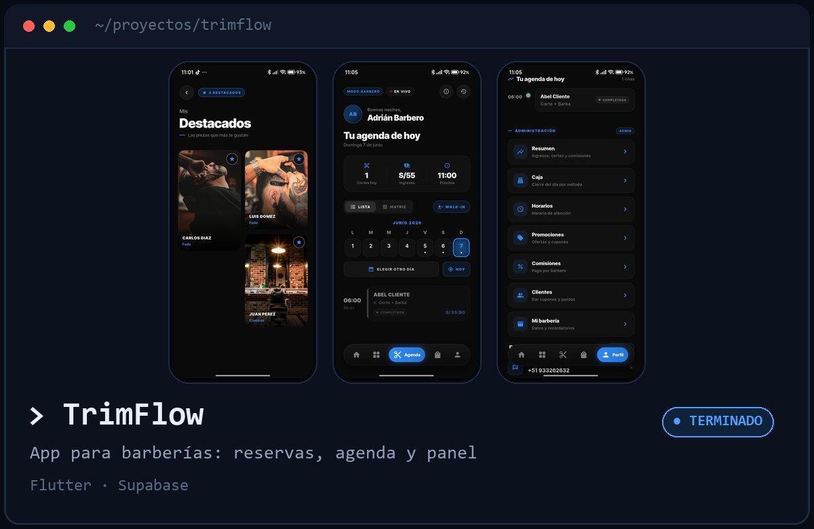</a></td>
  </tr>
  <tr>
    <td width="50%"><a href="https://safirox-zeta.vercel.app">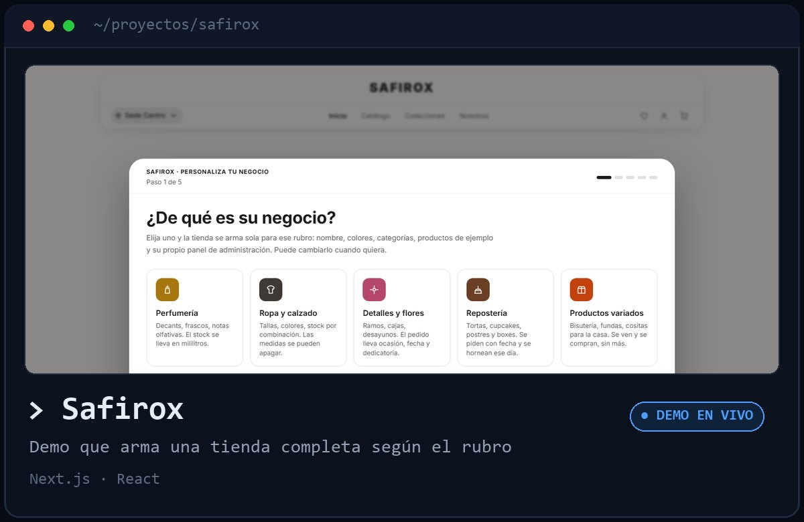</a></td>
    <td width="50%"><a href="https://constructorafadex.com.pe">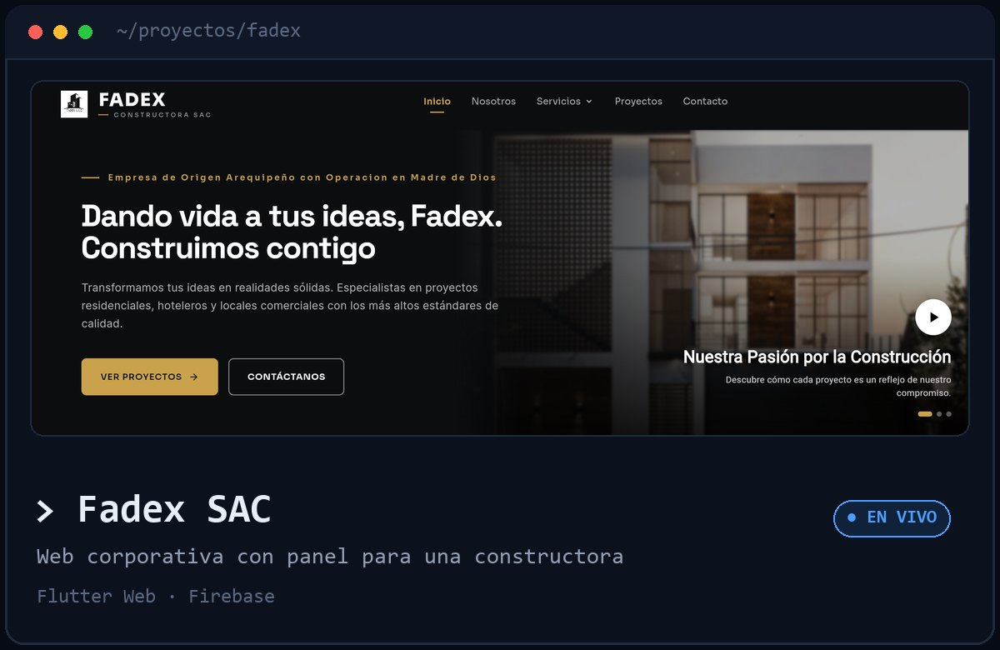</a></td>
  </tr>
  <tr>
    <td width="50%"><a href="https://abidetalles.web.app">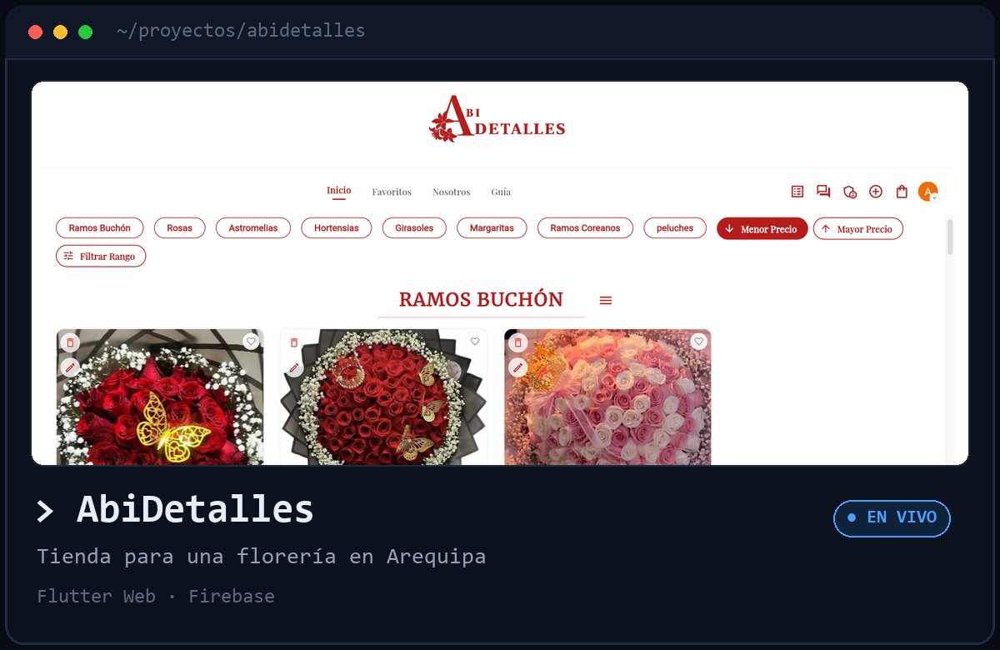</a></td>
    <td width="50%"><a href="https://portafoliogama.vercel.app/projects/safecheck">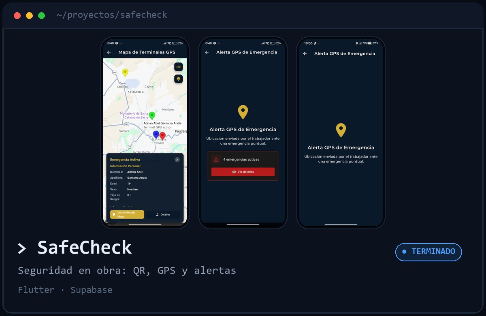</a></td>
  </tr>
  <tr>
    <td width="50%"><a href="https://portafoliogama.vercel.app/projects/perfumeria">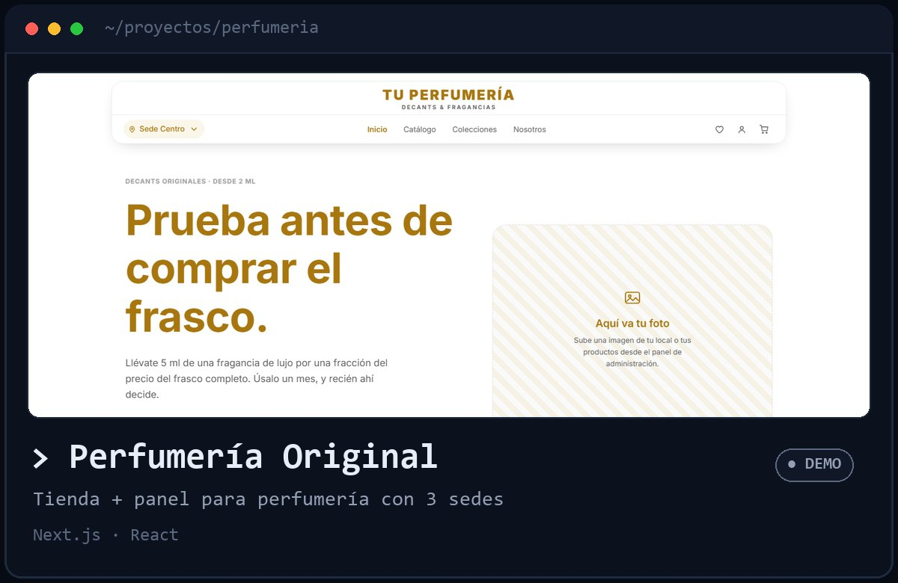</a></td>
    <td width="50%"><a href="https://calmaperu.com">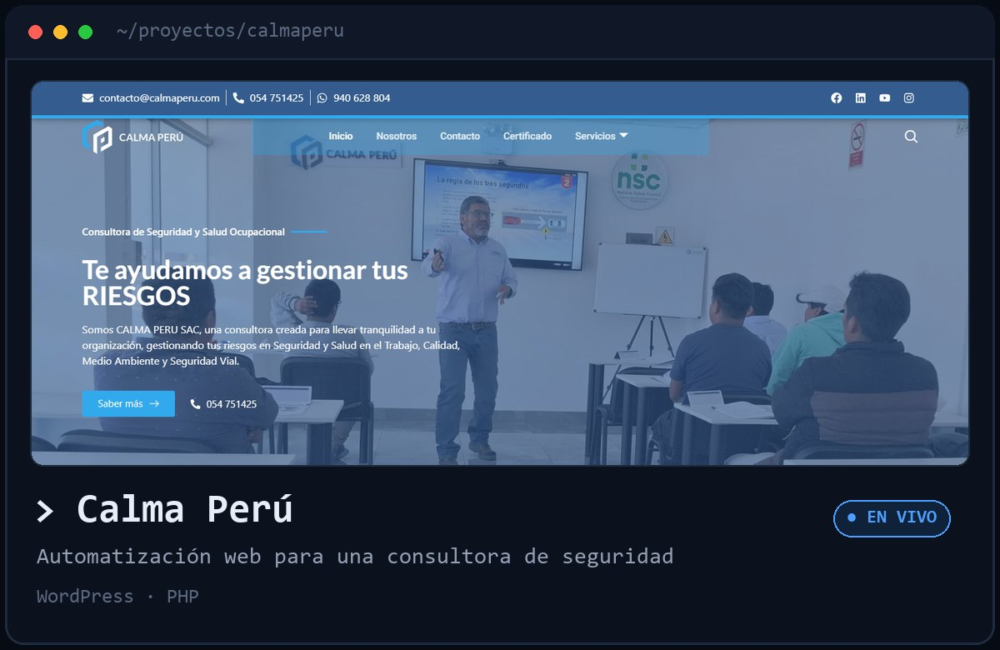</a></td>
  </tr>
</table>

Toca una tarjeta para ver la demo o el detalle en el portafolio.

## `> stack`

  
  
  
  
  
  
  
  
  

## `> cat memes.txt`

  
  

  

## `> actividad`

<picture>
  <source media="(prefers-color-scheme: dark)" srcset="https://raw.githubusercontent.com/AdrianAbeGama/AdrianAbeGama/output/snake-dark.svg">
  
</picture>

  
<code>↑ ↑ ↓ ↓ ← → ← → B A</code>

   
  

Hecho con café y muchos <code>git commit -m "arreglo final"</code> en Arequipa, Perú.

